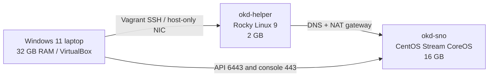

# openshift-single-node

Vagrant + VirtualBox lab that installs **single-node OKD** (the community distribution of OpenShift) on a personal Windows 11 laptop.

It is sized for a **32 GB RAM** host using the official single-node minimum: **4 vCPU / 16 GB RAM / 120 GB sparse disk** for the cluster, plus a **2 vCPU / 2 GB** helper VM. Windows 11 keeps about 12–14 GB.

This is OKD, not a paid OpenShift Container Platform subscription. The APIs, `oc` CLI, and web console match OpenShift for local testing. No Red Hat pull secret is required.

## What you get

| VM | Role | vCPU | RAM | Disk |
| --- | --- | ---: | ---: | --- |
| `okd-helper` | DNS, NAT gateway, ISO builder, `oc` | 2 | 2 GB | box default |
| `okd-sno` | Single-node OKD cluster | 4 | 16 GB | 120 GB sparse |

Default names:

- API: `https://api.okd.lab:6443`
- Console: `https://console-openshift-console.apps.okd.lab`
- Node: `192.168.56.20` (`sno.okd.lab`)
- Helper DNS: `192.168.56.10`



The helper is the SNO node's default gateway so the cluster has internet through VirtualBox NAT without a second NIC on the OpenShift node (OVN-Kubernetes is unreliable with two default routes).

## Host requirements

On the Windows 11 laptop:

1. [VirtualBox 7.x](https://www.virtualbox.org/) with the Extension Pack recommended
2. [Vagrant](https://developer.hashicorp.com/vagrant/install)
3. Hardware virtualization enabled in BIOS/UEFI (VT-x / AMD-V)
4. About **50 GB free disk** (the 120 GB VDI is sparse and grows as images are pulled)
5. Close heavy apps before `vagrant up` so 16 GB can be given to the cluster

If VirtualBox cannot start VMs because Hyper-V / WSL2 / Core Isolation is active, either:

- Install VirtualBox 7.1+ (it can run on the Windows hypervisor), or
- Turn off Memory Integrity / Core Isolation, or set `bcdedit /set hypervisorlaunchtype off` and reboot (this disables WSL2)

## Start the lab

From PowerShell in this repository:

```powershell
.\scripts\up.ps1
```

Or:

```powershell
vagrant up --provider virtualbox
```

First run typically takes **60–90 minutes**:

1. Helper VM boots and installs packages
2. OKD installer + CentOS Stream CoreOS live ISO download
3. Ignition is embedded in the ISO
4. `okd-sno` boots the ISO, installs to disk, pulls release images from `quay.io`
5. `openshift-install wait-for install-complete` finishes

Leave the laptop plugged in and do not sleep it during the first install.

### DNS on Windows

After install, run PowerShell **as Administrator**:

```powershell
.\scripts\set-windows-dns.ps1
```

That points the VirtualBox host-only adapter at `192.168.56.10` so `*.apps.okd.lab` resolves. Then open:

`https://console-openshift-console.apps.okd.lab`

The kubeadmin password is in `output/kubeadmin-password`. The kubeconfig is `output/kubeconfig`.

The helper already has `oc`:

```powershell
vagrant ssh helper -c "sudo bash /tmp/okd-scripts/status.sh"
```

## Stop, start, destroy

```powershell
vagrant halt                  # stops the helper; stop SNO in VirtualBox or:
VBoxManage controlvm okd-sno acpipowerbutton

vagrant up                    # starts helper, then the SNO VM if needed
vagrant destroy -f            # deletes helper and the okd-sno VM
.\scripts\unset-windows-dns.ps1
```

## Tune resources

Edit `config.yml` or set environment variables before `vagrant up`:

| Setting | Default | Env override |
| --- | --- | --- |
| OKD version | `4.22.0-okd-scos.7` | `OKD_VERSION` |
| Helper RAM (MB) | `2048` | `HELPER_MEMORY_MB` |
| SNO vCPU | `4` | `SNO_CPUS` |
| SNO RAM (MB) | `16384` | `SNO_MEMORY_MB` |
| SNO disk (GB) | `120` | `SNO_DISK_GB` |

16 GB is the documented single-node minimum. Going lower often fails during bootstrap. If the laptop is tight on RAM, set `SNO_MEMORY_MB=14336` only as an experiment.

Optional cluster operators are disabled (`baselineCapabilitySet: None`) so the 16 GB node has room for test workloads. Ingress, Console, OLM, Image Registry, and Cloud Credential stay enabled.

## Optional pull secret

OKD public images work with a dummy pull secret. To use your own (for example from [console.redhat.com/openshift/downloads](https://console.redhat.com/openshift/downloads)), place it at `pull-secret.json` in the repo root before `vagrant up`.

## Layout

```
Vagrantfile                 # helper VM + triggers that create okd-sno
config.yml                  # IPs and resource sizes
lib/vbox_sno.rb             # VBoxManage create/start/eject/destroy
scripts/helper-setup.sh     # DNS, IP forwarding, NAT
scripts/build-iso.sh        # OKD installer + live ISO
scripts/wait-install.sh     # wait-for install-complete
scripts/up.ps1              # Windows entrypoint
scripts/set-windows-dns.ps1
output/                     # ISO, kubeconfig, password, serial log
```

## Troubleshooting

- **Helper cannot download the ISO:** confirm the laptop has internet; retry `vagrant provision helper --provision-with iso`.
- **SNO never gets SSH:** read `output/sno-serial.log`. Confirm VirtualBox host-only is `192.168.56.0/24`.
- **Install hangs on image pulls:** the node must reach `quay.io` through the helper NAT. From the helper: `curl -I https://quay.io`.
- **Console name does not resolve:** run `scripts/set-windows-dns.ps1` as Administrator, or use `vagrant ssh helper` and `oc`.
- **Shared folder error on Windows:** `vagrant plugin install vagrant-vbguest` then `vagrant reload helper --provision`.
- **Not enough memory:** 16 GB SNO + 2 GB helper + Windows is tight. Close browsers and WSL before starting.

This lab is for local testing only. It is not highly available and is not a supported production OpenShift cluster.
